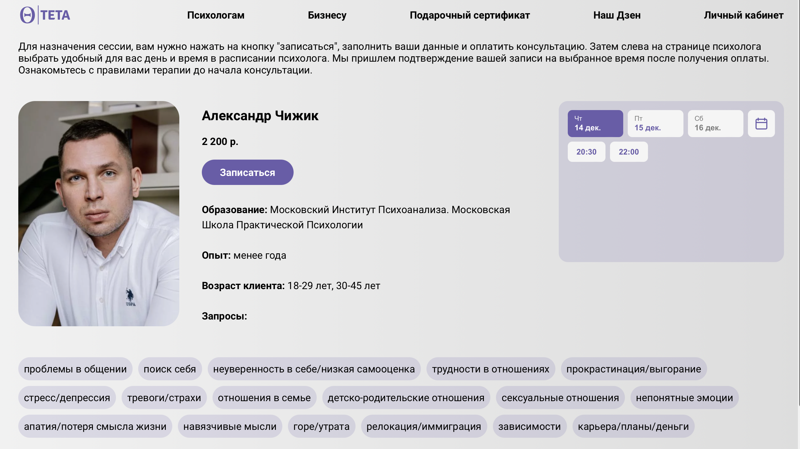

<h1 align="center">Psyhologists</h1>

---

<h2>Работа выполнена с использованием технологий:</h2>
<ul>
  <li>
HTML
</li>
  <li>
CSS
</li>
  <li>
JavaScript
</li>
  <li>
Flexbox Layout
</li>
  <li>
Grid Layout
</li>
  <li>
JavaScript
</li>
</ul>

<h2>Подключенные сервисы</h2>
<ul>
  <li>
JivoChat
</li> 
  <li>
OnDoc - сервис онлайн-бронирования
</li> 
  <li>
Тинькофф - платежная система/p></li> 
  <li>
Tilda
</li> 
</ul>

## Страница психологов:

Страница - каталог поиска психологов, с возможностью фильтрации по различным признакам: запросы, опыт, пол, возраст.

## Страница психолога:

Основной задачей было разместить на странице информацию о психологе, его фотографию, подключить виджет бронирования и при помощи JavaScipt отображать запросы в стилизованном в виде.

## Директории

`/icons` — папка с иконками
`/pages` — папка с файлами структуры страниц
`/styles&scripts` — папка с файлами скриптов и стилей

<h2>Над проектом работал:</h2>
<h3><a href="https://github.com/ilkor4" target="_blank">Корнелюк Илья</a></h3>

---

## Ссылки на проект

- Адрес репозитория: https://github.com/ilkor4/psyhologists
- Frontend https://teta.su